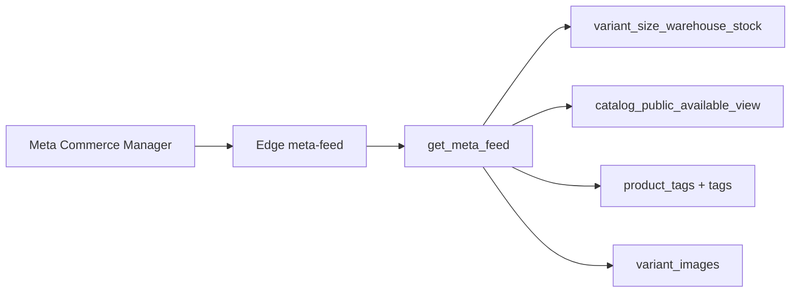

# Meta Catalog Feed — Auditoría y spec de enriquecimiento (2026-05-23)

> **Estado:** spec aprobado, pendiente implementación por fases.  
> **Alcance:** Edge `meta-feed`, RPC `get_meta_feed()`, admin `meta-feed.html`.  
> **Fuera de alcance:** PDP, router, carrito, catálogo público, lógica de stock/elegibilidad.

**Espejo Obsidian:** [[../../docs/FYL-Obsidian/38-META-FEED-ENRICHMENT-2026-05-23]]

---

## Resumen ejecutivo

El catálogo FYL **ya modela** categoría raíz, Filtro1–3, detalles comerciales, ofertas y stock por talle en `catalog_public_available_view`. El RPC `get_meta_feed()` **ya calcula** `item_group_id`, `color` y `size`, pero la Edge Function **exporta solo 9 columnas CSV**, por eso Meta Commerce Manager ve un feed plano.

**Solución:** cambios **100% additive** en 3 PRs separados, con normalización obligatoria vía `canonicalTagKey` / `splitCommercialTags` (port de `scripts/tag-normalize.js`).

---

## Arquitectura actual



| Componente | Ruta |
|------------|------|
| Edge Function | `supabase/functions/meta-feed/index.ts` |
| RPC | `supabase/canonical/41_meta_feed_rpc.sql` (+ `225_meta_feed_align_catalog_available.sql`) |
| Admin | `admin/meta-feed.js`, `admin/meta-feed.html` |
| Ejemplo CSV (desactualizado vs prod) | `META_FEED_EJEMPLO_CSV.md` |
| Validación CSV local | `scripts/outputs/meta-feed-csv-validate.mjs` |

---

## Hallazgo principal: CSV recortado

```typescript
// supabase/functions/meta-feed/index.ts — hoy
const metaHeaders = ["id", "title", "description", "availability", "condition", "price", "link", "image_link", "brand"];
```

| Capa | Columnas variantes / taxonomía |
|------|-------------------------------|
| RPC `get_meta_feed()` | `item_group_id`, `color`, `size` (+ joins tag1/tag2 solo para título) |
| CSV exportado | **9 columnas** — descarta lo anterior |
| `META_FEED_EJEMPLO_CSV.md` | Documenta 12 columnas (tampoco alineado con Edge) |

---

## Fuentes de datos reutilizables

### `catalog_public_available_view` (referencia de negocio)

| Columna vista | Uso Meta |
|---------------|----------|
| `Categoria` | Raíz: Calzado / Ropa / Otros → `custom_label_1`, `product_type`, `internal_label` |
| `Filtro1` | tag1 (level 1) → subtipo comercial |
| `Filtro2` | tag2 (level 2) |
| `Filtro3` | highlights tag3 |
| `DetallesSimilitud` | tags level 3 vía `product_tag_details` |
| `OfertaActiva` / `PrecioOferta` | `sale_price` (Fase 3) |
| `SupplierCode` | `fyl_originals` si FYL |
| `Imagen 1`–`3` | `additional_image_link` (Fase 3) |

### Jerarquía comercial FYL

Solo **3 categorías raíz** en `products.category`:

1. **Calzado** — Filtro1 = subtipo (botas, zapatillas, pantuflas…)
2. **Ropa** — Filtro1 = subtipo (camperas, buzos…)
3. **Otros** — Filtro1 = rubro (marroquinería, lencería…)

`product_type` formato: `Calzado > Botas` (Title Case display, keys normalizadas para mapping).

### Tags (`scripts/tag-normalize.js`)

| Función | Uso en feed |
|---------|-------------|
| `canonicalTagKey` | Mapa Google, dedupe `internal_label`, `custom_label_0` |
| `normalizeCommercialTag` | alias de `canonicalTagKey` |
| `normalizeTagDisplay` | Texto visible en `product_type` |
| `splitCommercialTags` | Filtro3, DetallesSimilitud, campos compuestos |

**Regla:** nunca construir labels/mapping desde strings crudos (`BOTAS` = `botas` = `texanas` → `bota`).

---

## Implementación por fases (orden obligatorio)

### Headers por fase

| Fase | Columnas nuevas | Total |
|------|-----------------|-------|
| Baseline (hoy) | — | 9 |
| **Fase 1** | `item_group_id`, `color`, `size`, `gender`, `product_type` | 14 |
| **Fase 2** | `google_product_category`, `custom_label_0`…`4`, `internal_label` | 22 |
| **Fase 3** | `sale_price`, `additional_image_link` + marketing en `custom_label_4` | 24 |

### Headers finales (post Fase 3)

```text
id,item_group_id,title,description,availability,condition,price,sale_price,link,image_link,additional_image_link,brand,color,size,gender,product_type,google_product_category,custom_label_0,custom_label_1,custom_label_2,custom_label_3,custom_label_4,internal_label
```

---

## FASE 1 — Variantes y product_type

**PR:** `feat/meta-feed-phase1-variants-product-type`

### Objetivo

Exportar agrupación y atributos de variante; `product_type` jerárquico FYL.

### SQL — `226_meta_feed_phase1_category_filtro1.sql`

Solo **additive** en `RETURNS TABLE` y `SELECT` (sin tocar CTEs de stock):

```sql
-- RETURNS TABLE agrega:
--   category text,
--   filtro1 text

-- SELECT agrega:
--   p.category::text AS category,
--   coalesce(nullif(btrim(t1.name), ''), '')::text AS filtro1,
```

### Edge — archivos nuevos

| Archivo | Contenido |
|---------|-----------|
| `tag-normalize.ts` | Port mínimo desde `scripts/tag-normalize.js` |
| `csv-schema.ts` | `META_CSV_HEADERS_PHASE1` |
| `enrichment-phase1.ts` | `buildProductType`, `detectGender`, `applyPhase1Enrichment` |

### `buildProductType(categoryRaw, filtro1Raw)`

- Display: `normalizeTagDisplay(category)` + ` > ` + `normalizeTagDisplay(filtro1)` si hay filtro1 key.
- Sin Filtro1: solo raíz (ej. `Calzado`).

### `detectGender(categoryRaw)` — v1

```typescript
function detectGender(categoryRaw: string): "female" | "male" | "unisex" {
  const root = normalizeCommercialTag(categoryRaw);
  if (root === "otros") return "unisex";
  if (root === "calzado" || root === "ropa") return "female";
  return "female"; // default FYL mayorista femenino
}
// Futuro: override por tags hombre/unisex en splitCommercialTags
```

### Cambios `index.ts`

- `applyPhase1Enrichment` después de normalización defensiva.
- `generateCSV(finalData, META_CSV_HEADERS_PHASE1)`.
- **Sin cambios** en filtro elegibilidad (SKU, stock, imagen, precio).

### Checklist deploy Fase 1

1. Migración `226` (staging → prod con aprobación).
2. `supabase functions deploy meta-feed`
3. `curl` feed → verificar **14 headers**
4. Commerce Manager → reimport → validar `item_group_id`, color, talle, `product_type`
5. **Esperar reindex** antes de Fase 2

---

## FASE 2 — Labels e inteligencia comercial

**PR:** `feat/meta-feed-phase2-labels-google`

### Objetivo

`internal_label` (prioritario), `custom_label_0–4`, `google_product_category`.

### SQL — `227_meta_feed_phase2_commercial_sources.sql`

```sql
-- RETURNS + SELECT additive:
--   filtro2 text,
--   filtro3 text,
--   detalles_similitud text,
--   supplier_code text,
--   oferta_activa boolean
```

### `internal_label` vs `custom_label`

| Aspecto | `internal_label` | `custom_label_0–4` |
|---------|------------------|---------------------|
| Prioridad segmentación | **Principal** (Meta, sin review, update rápido) | Secundario / conjuntos clásicos |
| Formato | `a\|b\|c` lowercase, dedupe por `canonicalTagKey` | Un valor por columna |
| Uso Advantage+ | Preferir conjuntos por `internal_label` | Compatibilidad CM legacy |

### Builder `internal_label`

```typescript
function buildInternalLabel(parts: string[], max = 12): string {
  const seen = new Set<string>();
  const out: string[] = [];
  for (const raw of parts) {
    for (const tag of splitCommercialTags(raw, { silent: true }).tags) {
      const key = normalizeCommercialTag(tag);
      if (!key || seen.has(key)) continue;
      seen.add(key);
      out.push(key);
    }
  }
  return out.slice(0, max).join("|");
}
```

Fuentes típicas: `category`, `filtro1`, `filtro2`, `filtro3`, `detalles_similitud`, `supplier_code` (FYL → `fyl_originals`), estación, oferta.

### `custom_label` slots (Fase 2)

| Campo | Contenido |
|-------|-----------|
| `custom_label_0` | Tipo comercial = key de Filtro1 (`botas`) |
| `custom_label_1` | Raíz (`calzado`, `ropa`, `otros`) |
| `custom_label_2` | Colección: prioridad `liquidacion` > `oferta` > `fyl_originals` > `premium` > vacío |
| `custom_label_3` | Estación: `invierno`, `verano`, `media_estacion` |
| `custom_label_4` | **Vacío en Fase 2** |

### Detección estación (heurística v1)

- Tags: `invierno`, `verano`, `media_estacion`, `frio`, `calor`
- Filtro1: ojota/sandalia/pantufla → sesgo verano; bota/borcego/texana → sesgo invierno (alineado `admin/stock-audit.js`)

### Checklist deploy Fase 2

1. Migración SQL
2. Deploy Edge
3. Reimport CM → **esperar 24–48 h** reindex antes de evaluar conjuntos

---

## FASE 3 — Ofertas, imágenes, marketing

**PR:** `feat/meta-feed-phase3-sale-price-images-marketing`

### `sale_price`

| Regla | Comportamiento |
|-------|----------------|
| Sin oferta | `price` = lista; `sale_price` vacío |
| Con oferta activa | `price` = **precio original**; `sale_price` = precio oferta |
| Formato | `45000 ARS` (mismo que `price`) |
| Elegibilidad | Sigue validando `price` (lista) > 0 |

Fuente: `color_price_offers` + `OfertaActiva` (misma lógica que vista catálogo).

### SQL — `228_meta_feed_phase3_offers_images.sql`

```sql
-- RETURNS + SELECT additive:
--   list_price numeric,
--   offer_price numeric,
--   oferta_activa boolean,        -- si no vino en Fase 2
--   additional_image_link text,   -- string_agg variant_images rank >= 2
--   fecha_publicacion timestamptz,
--   units_sold_90d int            -- opcional: join vw_stock_fast_sellers
```

### `additional_image_link`

- URLs posición 2–4 de `variant_images`
- Separador **coma** dentro del campo
- Campo entre comillas en CSV si contiene comas (`escapeCSV` existente)

### Marketing `custom_label_4` + tokens en `internal_label`

| Valor | Fuente |
|-------|--------|
| `top_seller` | `vw_stock_fast_sellers` (≥3 u/90d por product_id) |
| `new_arrival` | `fecha_publicacion` o alta < 120 días |
| `alta_rotacion` | opcional por `unidades_por_dia` |
| `remarketing` | reservado vacío v1 |

### Checklist deploy Fase 3

1. Migración ofertas + imágenes
2. Deploy Edge
3. Validar filas con oferta: `price` > `sale_price`
4. Reimport CM → tachado / dynamic ads (puede tardar)

---

## Mapa Google `mapGoogleCategory`

Clave: `${rootKey}:${filtro1Key}` donde ambos vienen de `normalizeCommercialTag`.

### Fallbacks

| `rootKey` | Fallback |
|-----------|----------|
| `calzado` | Apparel & Accessories > Shoes |
| `ropa` | Apparel & Accessories > Clothing |
| `otros` | Apparel & Accessories |
| desconocido | Apparel & Accessories |

### Calzado

| `filtro1Key` | Google taxonomy |
|--------------|-----------------|
| `bota`, `borcego`, `texana`, `botin` | Apparel & Accessories > Shoes > Boots |
| `pantufla` | Apparel & Accessories > Shoes > Slippers |
| `ojota`, `sandalia`, `chancleta`, `hawaiana` | Apparel & Accessories > Shoes > Sandals |
| `zapatilla`, `deportivo`, `running` | Apparel & Accessories > Shoes > Athletic Shoes |
| `mocasin` | Apparel & Accessories > Shoes > Loafers & Slip-Ons |
| `stiletto`, `taco`, `tacones` | Apparel & Accessories > Shoes > Heels |
| `bailarina`, `maryjane` | Apparel & Accessories > Shoes > Flats |
| `alpargata` | Apparel & Accessories > Shoes > Espadrilles |

### Ropa

| `filtro1Key` | Google taxonomy |
|--------------|-----------------|
| `campera`, `abrigo`, `parka`, `sobretodo` | Apparel & Accessories > Clothing > Outerwear |
| `buzo`, `hoodie`, `sweater`, `pullover` | Apparel & Accessories > Clothing > Activewear |
| `remera`, `musculosa`, `top` | Apparel & Accessories > Clothing > Shirts & Tops |
| `jean`, `pantalon`, `calza`, `legging` | Apparel & Accessories > Clothing > Pants |
| `short`, `bermuda` | Apparel & Accessories > Clothing > Shorts |
| `vestido` | Apparel & Accessories > Clothing > Dresses |
| `pollera`, `falda` | Apparel & Accessories > Clothing > Skirts |
| `pijama` | Apparel & Accessories > Clothing > Sleepwear & Loungewear |
| `conjunto`, `enterito` | Apparel & Accessories > Clothing > One-Pieces |

### Otros

| `filtro1Key` | Google taxonomy |
|--------------|-----------------|
| `marroquineria`, `cartera`, `bolso`, `mochila` | Apparel & Accessories > Handbags, Wallets & Cases |
| `lenceria`, `bombacha`, `corpino` | Apparel & Accessories > Clothing > Underwear & Socks |
| `accesorio`, `cinturon`, `gorro`, `bufanda` | Apparel & Accessories > Clothing Accessories |
| `bijouterie`, `bijou`, `aros`, `collar` | Apparel & Accessories > Jewelry |

**Post-deploy:** query read-only de `Filtro1` distintos por `Categoria` y extender mapa.

---

## Ejemplo CSV final (Fase 3)

```csv
id,item_group_id,title,description,availability,condition,price,sale_price,link,image_link,additional_image_link,brand,color,size,gender,product_type,google_product_category,custom_label_0,custom_label_1,custom_label_2,custom_label_3,custom_label_4,internal_label
1530-1-SUELA-37,a1b2c3d4-e5f6-7890-abcd-ef1234567890,Botas Invierno 1530-1 Suela Talle 37,Calzado femenino por mayor. Modelo 1530-1.,in stock,new,45000 ARS,39900 ARS,https://fylmoda.com.ar/catalogo?sku=1530-1-SUELA-37,https://res.cloudinary.com/dnuedzuzm/image/upload/f_auto,q_auto,w_1200/v1/main.jpg,"https://res.cloudinary.com/dnuedzuzm/image/upload/v1/img2.jpg,https://res.cloudinary.com/dnuedzuzm/image/upload/v1/img3.jpg",FYL,Suela,37,female,Calzado > Botas,Apparel & Accessories > Shoes > Boots,botas,calzado,fyl_originals,invierno,top_seller,calzado|botas|invierno|fyl_originals|top_seller
1530-1-NEGRO-38,a1b2c3d4-e5f6-7890-abcd-ef1234567890,Botas Invierno 1530-1 Negro Talle 38,Calzado femenino por mayor. Modelo 1530-1.,in stock,new,45000 ARS,,https://fylmoda.com.ar/catalogo?sku=1530-1-NEGRO-38,https://res.cloudinary.com/dnuedzuzm/image/upload/f_auto,q_auto,w_1200/v1/main-negro.jpg,,FYL,Negro,38,female,Calzado > Botas,Apparel & Accessories > Shoes > Boots,botas,calzado,fyl_originals,invierno,,calzado|botas|invierno|fyl_originals
MARRO-001-UNICO,b2c3d4e5-f6a7-8901-bcde-f12345678901,Cartera Classic Marroquineria,Cartera por mayor FYL.,in stock,new,28000 ARS,,https://fylmoda.com.ar/catalogo?sku=MARRO-001-UNICO,https://res.cloudinary.com/dnuedzuzm/image/upload/f_auto,q_auto,w_1200/v1/marro.jpg,,FYL,Negro,UNICO,unisex,Otros > Marroquineria,Apparel & Accessories > Handbags Wallets & Cases,marroquineria,otros,,,,otros|marroquineria
```

---

## Validación formato CSV

**Script:** `scripts/outputs/meta-feed-csv-validate.mjs`

```bash
node scripts/outputs/meta-feed-csv-validate.mjs
```

| Caso | Resultado |
|------|-----------|
| 23 columnas round-trip | OK |
| Comillas/comas en título | OK (RFC 4180) |
| `additional_image_link` con comas | OK (campo entre comillas) |
| Precio `NNNN ARS` | OK |

**Recomendación:** `sanitizeDescriptionForMeta` — colapsar `\n` → espacio en export.

**Meta:** `price` / `sale_price` = número + espacio + ISO 4217; `gender` ∈ female | male | unisex.

---

## Lo que NO se toca (todas las fases)

| Área | Estado |
|------|--------|
| CTEs stock / reservas / join `catalog_public_available_view` | Intacto |
| Filtro elegibilidad Edge | Intacto |
| `id`, `link`, `image_link` principal | Intacto |
| PDP, router, carrito, `main-supabase.js` | Sin cambios |

---

## Runbook post-deploy (Meta cachea fuerte)

```text
Fase N
  → supabase db push / migración aprobada
  → supabase functions deploy meta-feed
  → curl "?format=json&limit=5" → contar headers
  → Commerce Manager → Data sources → Fetch / Reupload
  → Esperar 24–48 h reindex
  → Validar filtros / conjuntos / preview anuncio
  → Solo entonces Fase N+1
```

Referencias deploy existentes: `INSTRUCCIONES_DEPLOY_META_FEED.md`, `DEPLOY_META_FEED.md`.

---

## Riesgos

| Riesgo | Nivel | Mitigación |
|--------|-------|------------|
| CM no mapea columnas nuevas | Medio | Reimport + field mapping |
| Productos sin Filtro1 | Medio | `product_type` solo raíz; métrica en logs |
| Mapping Google incompleto | Bajo | Fallback por raíz |
| Reindex lento | Esperado | No avanzar fase sin validar anterior |
| Romper feed actual | Alto | Solo columnas additive; mismos filtros |

---

## Conjuntos Meta objetivo (post Fase 2–3)

- Botas invierno → `internal_label` contiene `botas` + `invierno`
- Pantuflas premium → `custom_label_0` + `premium` en `internal_label`
- FYL Originals → `fyl_originals`
- Liquidación → `liquidacion` / `oferta`
- Más vendidos → `top_seller` (Fase 3)

---

## Compatibilidad Google Merchant (futuro)

- `google_product_category` listo en Fase 2
- `product_type` = taxonomía comercial FYL (libre)
- Mismo CSV puede alimentar GMC con mapping distinto

---

## Changelog documentación

| Fecha | Cambio |
|-------|--------|
| 2026-05-23 | Auditoría inicial + spec 3 fases aprobado |
