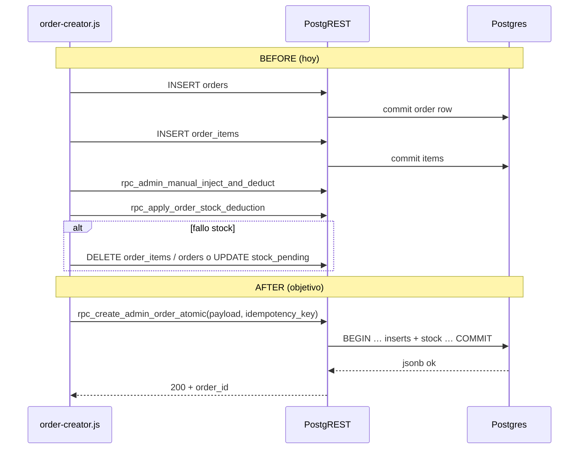

# RFC (borrador) — `rpc_create_admin_order_atomic`

**Estado:** DISEÑO — **sin implementación** ni cambios de frontend acordados en este documento.  
**Fecha:** 2026-05-15  
**Reemplaza flujo:** `admin/order-creator.js` → `createNewOrder` (alta pedido admin + ítems + stock).  
**Fase 2 (fuera del contrato mínimo de este RFC):** `addItemsToExistingOrder` → RPC hermana o extensión; se menciona solo al final.

**Referencias:** `doc/admin-writes-audit-stock-orders-2026-05-15.md`, `supabase/canonical/166_rpc_apply_order_stock_deduction.sql`, `admin/order-creator.js` (aprox. líneas 3613–3876).  
**Validación concurrencia / estrés conceptual (sin SQL):** `doc/rfc-create-admin-order-atomic-concurrency-stress-2026-05-15.md`  
**Idempotencia v1 congelada (contrato definitivo, sin SQL):** `doc/rfc-create-admin-order-atomic-idempotency-contract-v1-2026-05-15.md`

---

## 1. Objetivo

- **Una sola llamada** desde el admin que cree `orders` + `order_items` y aplique **toda** la mutación de stock asociada (manuales + deducción estándar) dentro de **la misma transacción PostgreSQL**.
- **Eliminar** el patrón actual: `INSERT` orden → `INSERT` ítems → RPC stock → **rollback manual** `DELETE` ítems/orden o marca `stock_pending`.
- **Preservar** PostgREST, Supabase Auth, rol admin, UX mobile-first (el frontend puede seguir armando el mismo payload; solo cambia *cuántas* llamadas hace al final).

---

## 2. Alcance

| Incluido | Excluido (fases posteriores) |
|----------|------------------------------|
| Creación de pedido **nuevo** (`source: admin`), cliente existente, ítems con el mismo shape lógico que hoy persiste `order-creator`. | `addItemsToExistingOrder` (edición): mismo riesgo parcial; RFC aparte o v2. |
| Validación de cliente, pre-check stock (equivalente a `validateStockBeforeSave`), split general/venta, ítems manuales (`rpc_admin_manual_inject_and_deduct` equivalente), deducción `rpc_apply_order_stock_deduction` equivalente. | Refactor de `orders.js`, catálogo público, checkout cliente B2B. |
| Idempotencia explícita y respuesta única para UI. | Nuevo framework; Edge obligatorio. |

---

## 3. Problemas actuales

1. **Varias idas a red** con estado intermedio visible en BD: orden e ítems existen **antes** de que el stock sea consistente.
2. **Rollback manual** en cliente (`DELETE order_items` + `DELETE orders`) si falla el stock; si falla el DELETE → orden **huérfana** o con ítems sin descuento aplicado.
3. **Marcado `stock_pending`** como segunda línea de defensa: correcto operativamente pero **síntoma** de que la atomicidad no está en el servidor.
4. **TOCTOU:** `validateStockBeforeSave` lee `variant_size_warehouse_stock` en el cliente; entre esa lectura y la RPC de descuento otro proceso puede consumir stock (mitigado en parte porque `166` vuelve a validar con `FOR UPDATE`, pero la **orden ya está creada** si el fallo ocurre después del insert).
5. **Doble envío / refresh:** dos clicks rápidos pueden crear dos órdenes (mitigación UI parcial; no hay clave de idempotencia global).
6. **Edición** `addItemsToExistingOrder`: si falla stock, **no** hay rollback de ítems insertados; solo `stock_pending` → ítems **huérfanos de stock** hasta intervención.

---

## 4. Flujo actual (frontend) — BEFORE

Secuencia real `createNewOrder` (simplificada):

1. Validar `customerId` (SELECT `customers`).
2. `getVariantIdsForItems` (batch SELECTs).
3. Mapear ítems persistibles (`picked` + `admin_confirmed_missing` según reglas).
4. `validateStockBeforeSave` (SELECT VSW, **sin lock**).
5. `INSERT orders` → devuelve `order`.
6. `INSERT order_items` (muchos ítems).
7. `applyManualConfirmedItems` → `rpc_admin_manual_inject_and_deduct`.
8. `updateStockBatch` → `rpc_apply_order_stock_deduction` (`p_source: order_creation`).
9. Si 7–8 fallan: rollback DELETE ítems + orden, o `UPDATE orders SET status='stock_pending'`.

**Puntos de fallo:** 5–6 (orden creada sin stock), 7 solo (stock manual OK, deducción falla), 8 solo, red intermitente entre 5 y 6, etc.

---

## 5. Race conditions y concurrencia

| Escenario | Riesgo hoy | Tratamiento en RPC atómica |
|-----------|------------|----------------------------|
| Dos admins crean pedido mismo cliente | Índice único / UX puede disparar error `23505` en `INSERT` orden | Misma validación server-side; opcional **advisory lock** `pg_advisory_xact_lock(hashtextextended(customer_id::text, 0))` durante la transacción para serializar por cliente (evaluar carga; alternativa: confiar en índice único parcial “un open order por customer”). |
| Doble click mismo payload | Dos pedidos | **Idempotency key** obligatoria o recomendada; tabla o `operation_requests` dedupe. |
| Stock concurrente checkout B2B vs admin | `166` ya bloquea filas VSW | La RPC atómica debe llamar **la misma** lógica interna (o `PERFORM` función compartida) **después** de validar orden “lógica” pero **antes** de commit — idealmente **sin** insertar orden hasta pasar pre-lock de stock (ver §7). |
| Refresh tras éxito | Re-POST duplicado | Idempotencia devuelve mismo `order_id` + `replay: true`. |

**`SELECT FOR UPDATE`:** ya en `166` sobre filas de stock; la RPC nueva debe asegurar que **toda** deducción ocurra en la **misma** transacción que inserts de orden/ítems.

**Advisory locks:** opcionales para “un create a la vez por customer”; no sustituyen `FOR UPDATE` en VSW.

---

## 6. Rollback manual actual (a retirar)

- `DELETE FROM order_items WHERE order_id = …`
- `DELETE FROM orders WHERE id = …`
- Si falla: `UPDATE orders SET status='stock_pending', notes=json` con `stock_pending_*`.

**Objetivo AFTER:** ningún DELETE compensatorio desde el cliente para el camino “crear pedido”.

---

## 7. Diseño transaccional — límites de transacción

**Opción recomendada (orden de operaciones dentro de un único `BEGIN … COMMIT`):**

1. Validar admin (`auth.uid()` ∈ `admins`) — igual espíritu que `166`.
2. Validar cliente y reglas de negocio (pedido abierto único, etc.) con locks **ligeros** o consultas actuales.
3. **Pre-reserva lógica:** agrupar deducciones como hace hoy `updateStockBatch` + manuales; **sin** insertar aún `orders` **o** insertar orden en estado **`creating`** no expuesto a UI (solo si existe columna; **preferible** no añadir estado nuevo).
4. **Mejor patrón sin nuevo estado:** locks + validaciones + **INSERT orders + order_items** solo cuando stock manual + aplicación de deducción **interna** vayan a ejecutarse en el mismo bloque; ejecutar:
   - bloque equivalente a `rpc_admin_manual_inject_and_deduct` (o llamarlo con `order_id` ya conocido si refactor interno permite “deferred” — hoy asume ítems con `id`; requiere **insert ítems primero** o refactor de la RPC manual para aceptar datos sin `order_item_id` temporal).
5. **Constatación:** las RPC actuales (`inject`, `apply`) esperan `order_item_id`. Por tanto el orden interno razonable es:
   - `INSERT orders` (transacción actual)
   - `INSERT order_items` **RETURNING** ids
   - `PERFORM` lógica inject con esos ids
   - `PERFORM` lógica apply deduction con esos ids  
   Todo en **una** función PL/pgSQL; **no** commits intermedios. Si cualquier paso lanza excepción → rollback automático de Postgres (sin orden visible a otros si se usa nivel de aislamiento adecuado; nota: **uncommitted** orden no visible a otras sesiones `READ COMMITTED` hasta COMMIT — correcto).

**Conclusión:** la atomicidad se logra **envolviendo** inserts + dos familias de escritura de stock en **una** función transaccional, extrayendo o delegando en subrutinas **sin** `COMMIT` propio.

---

## 8. Contrato RPC — `rpc_create_admin_order_atomic`

### 8.1 Firma sugerida

```sql
rpc_create_admin_order_atomic(
  p_payload       jsonb,
  p_idempotency_key uuid DEFAULT NULL
) RETURNS jsonb
```

- `SECURITY DEFINER`, `search_path = public, pg_catalog`.
- `GRANT EXECUTE` solo a `authenticated` (admin ya validado dentro).
- **Producción (recomendación gate):** tratar `p_idempotency_key` como **obligatoria** en contrato de cliente; `NULL` solo permitido en staging o hasta fecha de corte explícita (ver documento de estrés §10.1).

### 8.2 `p_payload` — esquema JSON (contract)

```jsonc
{
  "customer_id": "uuid",
  "total_amount": 12345.67,
  "notes": "string | object-serializado-como-hoy",  // opcional; mismo criterio que order-creator
  "source": "admin",
  "items": [
    {
      "variant_id": "uuid",
      "product_name": "string",
      "color": "string",
      "size": "string | null",
      "quantity": 2,
      "price_snapshot": 100.0,
      "imagen": "url | null",
      "status": "picked",
      "admin_confirmed_missing": false,
      "qty_from_general": 1,
      "qty_from_venta": 1
    }
  ],
  "extra_notes": {}  // opcional: merge a notes JSON como extraValues hoy
}
```

**Reglas de validación (servidor):** mismas que `itemQualifiesForApplyOrderStockDeduction`, mapeo a `picked` + `admin_confirmed_missing`, normalización de `size`, límites de cantidad > 0, sumas `qty_from_*` vs `quantity`.

### 8.3 Respuesta exitosa — `jsonb`

```jsonc
{
  "ok": true,
  "order_id": "uuid",
  "order_number": "string | null",
  "order_items": [
    { "id": "uuid", "variant_id": "uuid", "size": "...", "quantity": 2, "admin_confirmed_missing": false }
  ],
  "stock": {
    "manual_processed": 0,
    "deduction_applied_items": 0,
    "source": "order_creation"
  },
  "idempotency": {
    "replay": false
  }
}
```

### 8.4 Errores — códigos sugeridos (campo `code` en JSON o `RAISE SQLSTATE`)

| Código / `errcode` | Significado | Mensaje operativo (ES) |
|--------------------|-------------|-------------------------|
| `AUTH_REQUIRED` | `auth.uid()` nulo | Iniciá sesión de admin e intentá de nuevo. |
| `FORBIDDEN_NOT_ADMIN` | usuario no en `admins` | No tenés permisos para crear pedidos. |
| `CUSTOMER_NOT_FOUND` | `customers` inexistente | Cliente inválido. |
| `OPEN_ORDER_EXISTS` | violación regla un pedido abierto | El cliente ya tiene un pedido abierto; usá agregar ítems o cerrá el existente. |
| `STOCK_INSUFFICIENT` | fallo al aplicar deducción / pre-check | Stock insuficiente en depósito (detalle por variante/talle en `details`). |
| `MANUAL_INJECT_FAILED` | fallo inyección manual | No se pudo confirmar stock manual para un ítem. |
| `VALIDATION_FAILED` | JSON inválido / campos | Datos del pedido incompletos o inválidos. |
| `IDEMPOTENCY_REPLAY` | misma key, mismo resultado | (No error) `ok: true`, `idempotency.replay: true`. |
| `IDEMPOTENCY_CONFLICT` | misma key, payload distinto | Ya existe un pedido con esta referencia interna y distintos datos. Contactá soporte. |
| `DEADLOCK_RETRY` | SQLSTATE `40P01` (deadlock detectado) | Otra operación chocó al mismo tiempo. Reintentá en unos segundos con la misma clave de idempotencia. |

**Transporte PostgREST:** errores `RAISE EXCEPTION` mapean a HTTP 4xx/5xx con `code` / `message` en cuerpo JSON estándar Supabase. El cliente debe mapear `40P01` a reintento idempotente con backoff (ver estrés §3.3).

---

## 9. Idempotencia y `operation_id`

**Fuente normativa v1:** `doc/rfc-create-admin-order-atomic-idempotency-contract-v1-2026-05-15.md` (estrategia **híbrida transaccional**: fila dedupe `pending` al inicio de la misma transacción que el pedido; `UPDATE` a `success` + `response_jsonb` antes del `COMMIT`; sin estado `FAILED` ni dedupe huérfano al abort).

### 9.1 Idempotencia (resumen)

- **`p_idempotency_key`:** UUID generado por el **cliente** una vez por intención de creación (p. ej. al confirmar).
- **Tabla dedupe:** columnas y flujo según contrato §6–§7 del documento congelado (`status` `pending` → `success`, `payload_hash`, `response_jsonb`, validación mismo `admin_user_id` en replay).
- **Conflictos / replay:** mismo key + mismo hash → **replay** 200; mismo key + hash distinto → **`IDEMPOTENCY_CONFLICT`**.
- **Concurrencia misma clave:** matriz en `doc/rfc-create-admin-order-atomic-concurrency-stress-2026-05-15.md` §2.

### 9.2 `operation_id` (infra 169 / picked)

- La creación de pedido **no** usa hoy `operation_id` en `rpc_apply_order_stock_deduction` (firma `jsonb, uuid, text`).
- **Fase 1:** no es obligatorio introducir `operation_id` en esta RPC si no hay replay cross-RPC con `rpc_mark_order_items_picked`.
- **Fase 1.b opcional:** devolver en la respuesta un `client_trace_id` = `p_idempotency_key` para correlación logs.

---

## 10. Retry safety (frontend sin cambiar UX)

| Situación | Comportamiento esperado |
|-----------|-------------------------|
| Timeout de red tras **COMMIT** server | Reintento con **misma** `p_idempotency_key` → `replay: true`, mismo `order_id` — UI debe mostrar éxito sin duplicar. |
| Error **antes** de commit | Rollback: no hay pedido ni fila dedupe (`pending` va en la **misma** TX — ver contrato idempotencia v1). Reintento con **misma** clave = intento limpio de nuevo. |
| Usuario cierra pestaña | Si no reintenta, no hay pedido (transacción abortada) — OK. |
| Doble click sin key | Sin `p_idempotency_key` cada POST es independiente → **riesgo alto de duplicados**. Producción: **clave obligatoria** (ver §8.1 y estrés §10.1). |

---

## 11. Evaluación explícita: advisory locks / `FOR UPDATE` / conflictos

- **`FOR UPDATE`:** reutilizar estrategia de `166` dentro de la misma transacción (subfunción compartida o `EXECUTE` de lógica interna).
- **Advisory lock por `customer_id`:** reduce carreras “dos pedidos abiertos”; costo: serialización. **Decisión:** probar primero con restricción existente (índice único parcial); si métricas muestran `23505` frecuente, añadir advisory lock **transaccional** (`xact`).
- **Conflictos concurrentes con checkout cliente:** mismas filas VSW; `166` serializa por fila — mantener.

---

## 12. Compatibilidad

| Área | Impacto |
|------|---------|
| **Dashboard / listados** | Solo ven pedido **tras** COMMIT atómico; desaparecen estados intermedios “orden sin stock”. |
| **`rpc_reconcile_stock`** | Sin cambio; sigue corrigiendo drift histórico. Menos casos `stock_pending` por fallos de creación. |
| **`rpc_cancel_order_full`** | Sin cambio; cancela orden ya consistente. |
| **Realtime `order_items`** | Menos eventos “INSERT seguido de DELETE”; mejor para badges. |
| **Mobile-first** | Una llamada = menos spinners y menos código de error de rollback en JS (implementación futura). |

---

## 13. Secuencia BEFORE vs AFTER (diagrama)



---

## 14. Riesgos operativos reales (post-RFC)

- Complejidad de **refactor interno** de `rpc_admin_manual_inject_and_deduct` si no puede llamarse con `order_item_id` ya insertado (verificar hoy dependencias).
- Tamaño máximo de `p_payload` (PostgREST / límites JSON) para pedidos enormes — mismo límite práctico que hoy (muchos inserts).
- Migración **blue/green:** mantener `createNewOrder` detrás de feature flag llamando a la nueva RPC cuando esté probada en staging.

---

## 15. Fuera de alcance inmediato

- Implementación SQL/JS en **producción** (ver plan staging: `doc/plan-implementacion-rpc-create-admin-order-atomic-staging-2026-05-15.md`).
- **`addItemsToExistingOrder`:** candidata a `rpc_add_admin_order_items_atomic` con misma filosofía (transacción única + idempotencia por `order_id`+key).

---

## 16. Checklist pre-implementación (cuando se apruebe)

- [ ] Releer cuerpos de `rpc_admin_manual_inject_and_deduct` y `rpc_apply_order_stock_deduction` para extracción a subrutina compartida o llamadas encadenadas en una TX.
- [ ] Definir tabla idempotencia y RLS (solo service/admin si aplica).
- [ ] Pruebas: doble click, timeout simulado, stock insuficiente, cliente sin pedido abierto, cliente con pedido abierto.
- [ ] Actualizar `doc/admin-writes-audit-stock-orders-2026-05-15.md` con estado “RFC aprobado / implementado”.
- [ ] Cerrar gate de concurrencia: checklist en `doc/rfc-create-admin-order-atomic-concurrency-stress-2026-05-15.md` §15.
- [ ] Cumplir contrato idempotencia v1: `doc/rfc-create-admin-order-atomic-idempotency-contract-v1-2026-05-15.md` §11 (cliente + servidor).
- [ ] Seguir plan implementación staging: `doc/plan-implementacion-rpc-create-admin-order-atomic-staging-2026-05-15.md` (orden migraciones, checklists §9–§10).
