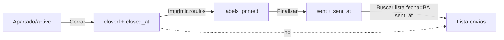

# 39 — Lista de envíos: fecha por finalización (`sent_at`)

**Fecha:** 2026-05-26  
**Estado:** Desplegado en prod (`fyl-core` / `dtfznewwvsadkorxwzft`)  
**Migración:** `supabase/canonical/227_shipping_list_sent_at_only.sql` (Supabase migration `227_shipping_list_sent_at_only`)

---

## Problema

En `admin/closed-orders.html` → **Imprimir Lista de Envíos**, pedidos **cerrados un día** (ej. sábado) y **finalizados otro** (ej. lunes) aparecían en la lista del día de **cierre**, no del de **finalización**.

**Causa en prod (pre-fix):**

1. `rpc_mark_order_as_sent` no escribía `sent_at` (solo `status = 'sent'` y `updated_at`).
2. `rpc_get_shipping_orders` hacía fallback a `closed_at` cuando `sent_at` era NULL.

Evidencia auditoría: ~1.409 pedidos `sent` sin `sent_at`; ~8 casos sáb 23/05 → lun 26/05/2026.

---

## Regla de negocio (desde el deploy)

| Campo | Momento | Uso |
|-------|---------|-----|
| `closed_at` | Al **cerrar** (`rpc_close_order`) | Grilla «Pedidos cerrados»; **no** lista de envíos |
| `sent_at` | Al **finalizar** (`rpc_mark_order_as_sent`) | Lista del día, Excel «Extraer», criterio único en BA |

**Cerrar ≠ aparecer en lista.** Solo tras **Finalizar (Enviar)** con rótulos impresos.

---

## Cambios aplicados

### SQL (prod)

| Objeto | Cambio |
|--------|--------|
| `rpc_mark_order_as_sent` | `SET status = 'sent', sent_at = now(), updated_at = now()` |
| `rpc_get_shipping_orders` | Solo `status = 'sent'`, `sent_at IS NOT NULL`, fecha BA = `p_date` |
| `rpc_get_shipping_orders_range` | Mismo criterio para Excel |

**Sin backfill** (decisión operativa): pedidos históricos `sent` sin `sent_at` **no** se corrigen; no salen en listas por fecha. Solo aplica a finalizaciones **desde el deploy**.

**No** se desplegó `67_DAILY_SALES_ENVIOS_DESDE_CERO` completo: prod mantiene trigger `register_envio_to_daily_sales` (usa `COALESCE(sent_at, updated_at)`).

### Frontend (repo)

| Archivo | Cambio |
|---------|--------|
| `admin/closed-orders.html` | Hint: lista = fecha de finalización |
| `admin/closed-orders.js` | Alerta tras «Finalizar» |
| `TROUBLESHOOTING_LISTA_ENVIOS.md` | Criterio actualizado |

### Doc operativa

| Archivo | Rol |
|---------|-----|
| `doc/shipping-list-sent-at-deploy-2026-05-26.md` | Informe + verificación post-deploy |

---

## Flujo operativo



Pantalla: `admin/closed-orders.html`  
RPC lista: `rpc_get_shipping_orders(p_date, p_transport_id)`  
Transporte: `orders.transport_id` o `customers.transport_id`

---

## Verificación

```sql
-- Nuevas finalizaciones deben tener sent_at
SELECT COUNT(*) FROM orders
WHERE status = 'sent' AND sent_at IS NULL
  AND updated_at > '2026-05-26'::timestamptz;  -- ajustar fecha deploy

-- Día de lista para un pedido
SELECT order_number,
  (sent_at AT TIME ZONE 'America/Argentina/Buenos_Aires')::date AS dia_lista
FROM orders WHERE order_number = '...';
```

UI: modal Imprimir lista → transporte + **fecha de hoy** → pedidos finalizados hoy.

---

## Excepciones / deuda

| Caso | Acción |
|------|--------|
| Pedido `sent` viejo sin `sent_at` | No en listas por fecha; opcional: `rpc_reschedule_sent_order` si hace falta un caso puntual |
| Mover enviado a otra fecha | `rpc_reschedule_sent_order` (`admin/sent-orders.js`) |
| Listas guardadas (`shipping_lists`) | Snapshot; no se recalculan solas |
| Alinear `daily_sales` envíos con lista | Trigger ya usa `sent_at`; históricos sin `sent_at` pueden diferir de lista (sin backfill) |

---

## Rollback

Restaurar `pg_get_functiondef` previo de las 3 RPC. Sin `UPDATE` de datos si no hubo backfill.

---

## Enlaces

- [[05-FLUJO-PEDIDOS]] — estados y RPCs
- [[17-AUDITORIA-MODULO-ORDERS]] — módulo Orders / `closed-orders.js`
- [[13-RPCS-DEPLOY-STATE]] — registro deploy RPC
- `doc/shipping-list-sent-at-deploy-2026-05-26.md`
- `TROUBLESHOOTING_LISTA_ENVIOS.md`
