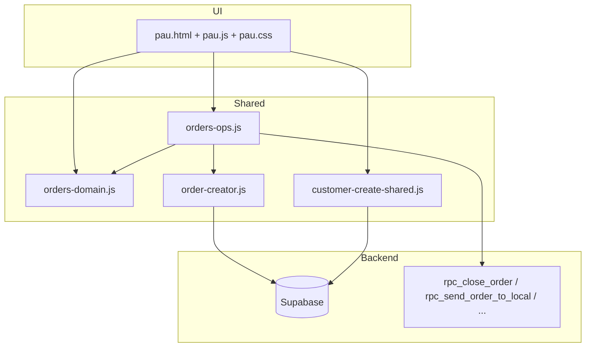

# 40 — PAU: Panel de Atención Unificado

> **Estado:** operativo en repo (2026-05).  
> **Fuente canónica (`/doc`):** `doc/pau/README.md`  
> **Código:** `admin/pau.html`, `admin/pau.js`, `admin/pau.css`

**Relacionado:** [[17-AUDITORIA-MODULO-ORDERS]], [[05-FLUJO-PEDIDOS]], [[08-PERMISOS-Y-ROLES]], [[03-FLUJO-PEDIDOS-Y-STOCK]] (stock en ítems), `doc/stock/stock-arquitectura.md`

---

## Propósito

PAU es la pantalla **rápida en celular** para operar pedidos B2B cuando la clienta escribe por WhatsApp:

1. Identificar o crear la clienta.
2. Escanear códigos QR (o elegir producto/color/talle manual).
3. Acumular un **borrador** local (“Productos por agregar”).
4. Persistir en Supabase con el mismo pipeline que **Pedidos** (`order-creator` + RPCs de stock).
5. Opcionalmente **cerrar** el pedido o **enviar al local**.

No reemplaza `admin/orders.html` (gestión completa, edición línea a línea, stock pendiente avanzado, etc.).

---

## Acceso

| Requisito | Comportamiento |
|-----------|----------------|
| Sesión admin | `requireAuth()` + `getAdminPermissions()` |
| `orders` view | Sin permiso → `alert` + redirect `admin/index.html` |
| `orders` edit | **Obligatorio** para PAU (solo view no alcanza) |
| `customers` edit | Habilita **Crear clienta** |

Entrada: tarjeta **PAU** en `admin/index.html` (`data-module="orders"`).

---

## Arquitectura de módulos



| Capa | Responsabilidad |
|------|-----------------|
| `pau.js` | Modos UI, borrador, cola QR, picker manual, `localStorage`, toasts |
| `orders-ops.js` | Pedido activo, chips, `addItemsToOrder`, `closeOrder`, `sendOrderToLocal`, búsqueda manual por prefijo |
| `order-creator.js` | Validación stock batch, inyección manual, escritura `order_items` |
| `orders-domain.js` | `normalizeCustomerSearchText`, `rankCustomersForSearch`, `computeWarehouseQtySplitForOrderItem` |
| `customer-create-shared.js` | Validación teléfono AR, provincias/ciudades, `rpc_create_admin_customer` |

**Explícito:** PAU **no** carga `orders.js` (~miles de líneas + DOM de Pedidos).

---

## Modos de pantalla

| Modo | Elemento | Cuándo |
|------|----------|--------|
| **Landing** | `#pau-landing` | Búsqueda de clienta (estado inicial tras F5) |
| **Teléfono compartido** | `#pau-phone-confirm` | Pegar URL/`?text=` con teléfono; confirmar “¿Es esta clienta?” |
| **Compose** | `#pau-compose` + `#pau-top` | Clienta seleccionada; escaneo / manual / borrador |
| Diálogos | `<dialog>` | Cerrar pedido, enviar al local, crear clienta |

Funciones de transición en `pau.js`: `showLandingMode`, `showPhoneConfirmMode`, `showComposeMode`, `goToCustomerSearchLanding`.

---

## Flujo 1 — Buscar clienta

**Input:** `#pau-customer-search` (debounce 280 ms).

**Query Supabase** (`customers`):

- `full_name`, `dni`, `email`, `customer_number` → `ilike %query%`
- Teléfono: se extraen dígitos; si hay ≥4, búsqueda por **últimos 4** en `phone` (soporta formatos tipo `+54 9 362 475-5101` compartidos por WhatsApp).

**Ranking:** `rankCustomersForSearch` (`orders-domain.js`).

**Chips de pedido:** `getOrderStatusChipForCustomers` → etiquetas `PAU_ORDER_CHIP_LABELS` (Pedido, Espera, Cerrado, Stock pend., etc.).

**Auto-selección:** si hay **exactamente 1** resultado y query ≥3 caracteres, se muestra una sola tarjeta (click → `selectCustomer`).

### Historial (botón reloj)

- Botón `#pau-recent-toggle` junto al buscador.
- Panel `#pau-recent-panel`: hasta **5** clientas en `localStorage` clave `pau_recentCustomers`.
- Se actualiza en cada `selectCustomer` (abrir clienta cuenta; no solo “buscar sin abrir”).
- Al escribir en el buscador se oculta el panel; al cerrar el panel, si había query ≥2 se re-lanza búsqueda.
- Persiste entre recargas (a diferencia de sesión activa).

### Crear clienta

- Visible con `customers` edit.
- Formulario en `#pau-create-customer-dialog`; validación compartida con `customers.html`.
- RPC: `createAdminCustomer` → `selectCustomer` automático.

---

## Flujo 2 — Teléfono compartido / deep link

**Triggers:**

- Query `?text=` o `?phone=` al cargar (Web Share Target / wrapper).
- `paste` en documento si no hay clienta activa y texto >6 chars.

**Lógica** (`handleSharedPhoneText`):

1. `normalizePhoneForSearch` → dígitos.
2. Busca `phone.ilike.%últimos4%`.
3. Prioriza match exacto de dígitos, luego inclusión, luego primera fila.
4. Modo confirmación: Sí → `selectCustomer`; No → landing.

Guarda `pau_lastPhoneShared` con dígitos normalizados.

---

## Flujo 3 — Seleccionar clienta (`selectCustomer`)

1. `findActiveOrderForCustomer(customerId)` — estados abiertos: `active`, `closing_soon`, `stock_pending`.
2. **Regla UI:** si el pedido no tiene ítems “operativos” cargados, `state.order = null` → cabecera muestra **“Sin pedido”** hasta que el usuario pulse **Agregar al pedido** (aunque exista pedido vacío en DB).
3. `state.draft = []` (borrador nuevo por sesión de clienta).
4. `pushRecentCustomer`, `showComposeMode`, `refreshOrderUi`.

Cabecera (`renderCustomerHeader`): nombre, teléfono, localidad, estado pedido (`getPedidoStatusLabel`).

---

## Flujo 4 — Escanear QR

**Input:** `#pau-product-input` (modo no manual).

| Constante | Valor |
|-----------|-------|
| `QR_MIN_DIGITS` | 6 |
| `QR_DEBOUNCE_MS` | 50 |

- Código numérico completo → `enqueueQr` → cola serial `processQrQueue`.
- `resolveQrCodeToOrderItem(code)` (`order-creator.js`) — usa `get_effective_price` (oferta por color si hay).
- `mergeDraftItem(state.draft, item)` — fusiona misma variante+talle+status; al fusionar **borra** `qty_from_general` / `qty_from_venta` para recalcular split.
- `enrichDraftItemsWithStock(state.draft)` — reparto depósito general / venta público.
- `saveSession` + `renderDraft` + toast.

Enter en input dispara escaneo si no está modo manual.

---

## Flujo 5 — Modo manual

Toggle `#pau-manual-toggle` → `setManualMode`.

Pasos (`state.manual`):

1. **search** — `searchProductsGroupedByPrefix` (mín. 2 caracteres, debounce 300 ms).
2. **product** — lista productos; elegir uno.
3. **color** — variantes por color.
4. **size** — talles; cantidad pendiente por variante+talle (`pending` Map).

**Agregar seleccionados:** `flushManualPendingToDraft` → ítems al borrador + `enrichDraftItemsWithStock` + `clearManualSearchForNextProduct()` (cierra picker y limpia input).

UX: cabecera del picker oculta si no hay “Volver”; scroll solo con muchas opciones (`is-scrollable`); tipografía botones ~15px.

---

## Flujo 6 — Borrador (“Productos por agregar”)

- Lista `#pau-draft-list`: una fila por ítem (nombre · color · talle · cantidad).
- Contador `#pau-scanned-count` (número destacado).
- Quitar ítem: splice + `saveSession`.
- Botón **Agregar al pedido** (`#pau-add-to-order`):
  - Habilitado si `canAddDraftToOrder()`: clienta, qty>0, `orders` edit, pedido no closed/cancelled.

### `handleAddToOrder`

1. Si no hay `state.order.id` → `createApartadoOrder` (reusa pedido activo o `createNewOrder` con `{ pau_source: true }`).
2. `addItemsToOrder(orderId, items)` → enrich + `addItemsToExistingOrder` + **`recalculateOrderTotalWithOffersAndPromos`**.
3. Limpia borrador, `saveSession`.
4. **Permanece en compose** con la clienta y el pedido cargado (`refreshOrderUi`) para poder cerrar o seguir operando.

### Ofertas y promociones (desde `offers.html`)

PAU aplica ambos sistemas al armar / mostrar / copiar el pedido:

| Sistema | Fuente | Comportamiento en PAU |
|---------|--------|------------------------|
| **Oferta por color** | `color_price_offers` vía RPC `get_effective_price` | Precio unitario al escanear / elegir manual |
| **Promo 2x1 / 2xMonto** | `promotions` + `promotion_items` vía `get_active_promotions_for_variants` | Se suman cantidades de **todos** los productos de la promo; `groups = floor(qty/2)`; total = `groups * fixed_amount` (+ ítems fuera de promo) |

Ejemplo 2xMonto `$34000` con 4 productos en la promo: 2 unidades (cualquiera de esos 4) → 1 grupo → `$34000`; 4 unidades → 2 grupos → `$68000`.

Helpers en `orders-ops.js`: `computeOffersAndPromotionsForItems`, `recalculateOrderTotalWithOffersAndPromos`. El resumen UI, WhatsApp y `orders.total_amount` usan el total **pagable** (con descuento).

**Errores:**

| Código / texto | UX |
|----------------|-----|
| `STOCK_CONFLICT_PRECHECK` | Toast |
| `stock_pending` | Toast + `refreshOrderUi` (queda en compose) |
| Otros | `alert` |

---

## Flujo 7 — Pedido ya guardado

Sección `#pau-existing-order`:

- Resumen: cantidad ítems + total.
- Toggle desplegar ítems (`orderExpanded`).
- Cada ítem en **una fila**: nombre en negrita · color · talle · cantidad (`pau-item-main`).
- **Quitar** (si `orders` edit y pedido no cerrado/cancelado): `removeOrderItemRestoreStock` → `rpc_remove_order_item_restore_stock` (mismo que Pedidos / `deleteOrderItemImmediate`). Devuelve stock y actualiza total; si el pedido queda vacío puede eliminarse vía `maint_try_delete_order_if_eligible`.
- **Copiar pedido** (mitad inferior izquierda): copia al portapapeles texto WhatsApp (`*Pedido FYL*`, líneas `• nombre — color — Talle — xN`, cantidad total y total en ARS; sin nombre de clienta). Requiere pedido con ítems guardados.
- **Cerrar pedido** (mitad inferior derecha): solo si `canCloseCurrentOrder()` — pedido con productos, no closed/cancelled, `orders` edit.

### Diálogo cerrar

| Botón | Acción |
|-------|--------|
| Contra Rem. | `closeOrder(id, "Contra Reembolso")` |
| Pagado | `closeOrder(id, "Pagado")` |
| Enviar al local | Confirmación → `sendOrderToLocal` → `rpc_send_order_to_local` |

Mismos strings que `ORDER_PAYMENT_METHOD` / Pedidos. Tras **Contra Rem.** o **Pagado**: toast + `goToCustomerSearchLanding()`. Tras **Enviar al local**: toast + `refreshOrderUi` (permanece en compose).

---

## Flujo 8 — Buscar otra clienta

`#pau-search-another-customer` → `clearActiveCustomerAndShowSearch`:

- Si hay borrador sin guardar → `confirm` descartar.
- `goToCustomerSearchLanding()` (limpia sesión, QR, manual, resultados).

---

## `localStorage` — contrato

| Clave | Persiste tras F5 | Notas |
|-------|------------------|-------|
| `pau_activeCustomerId` | **No** (borrado al init) | Solo durante sesión de página si se usara restore |
| `pau_activeOrderId` | **No** | Idem |
| `pau_draftItems` | **No** | JSON array borrador |
| `pau_recentCustomers` | **Sí** | Max 5 objetos `{ id, full_name, phone, city, province, … }` |
| `pau_lastPhoneShared` | **Sí** | Dígitos teléfono compartido |

**Init al cargar** (`pau.js` final): siempre limpia customer/order/draft y `showLandingMode()`, excepto procesar `sharedText` de URL.

`tryRestoreSession()` existe pero **no se invoca** en el bootstrap actual (sesión no se restaura al recargar).

---

## Stock y split depósitos

`enrichDraftItemsWithStock` (`orders-ops.js`):

- Lee `variant_size_warehouse_stock` (general + venta público).
- `computeWarehouseQtySplitForOrderItem` → `qty_from_general` + `qty_from_venta` debe igualar `quantity` para deducción RPC.
- Si no hay stock: `status: missing`, `admin_confirmed_missing: true`.
- Reutiliza split existente solo si la suma ya coincide con cantidad.

`mergeDraftItem` al incrementar cantidad **elimina** split previo para forzar recálculo en el siguiente enrich.

---

## Diferencias vs `orders.html`

| Aspecto | PAU | Pedidos |
|---------|-----|---------|
| UI | Una columna, touch-first | Tabla / panel completo |
| Edición ítems guardados | No (solo ver desplegable) | Sí |
| Métodos de pago al cerrar | 2 + enviar local | Lista completa `payment_methods` |
| Sesión al recargar | Siempre landing | Mantiene contexto según implementación |
| Código | `pau.js` + `orders-ops.js` | `orders.js` + mismos creators |

---

## Verificación y troubleshooting

### Checks locales

```bash
node --check admin/pau.js
node --check admin/orders-ops.js
node --check admin/customer-create-shared.js
```

### Smoke operativo

1. Entrar con usuario `orders` edit.
2. Buscar clienta → compose.
3. Escanear o manual → borrador > 0.
4. Agregar al pedido → toast + **vuelta a landing**.
5. Reloj → clienta en historial.
6. Cerrar pedido (si hay ítems guardados) → estado Cerrado en chip.

### Problemas frecuentes

| Síntoma | Causa probable |
|---------|----------------|
| Botón Agregar deshabilitado | Sin `orders` edit, sin clienta, borrador vacío, o pedido closed/cancelled |
| Error stock al agregar | Split inconsistente — revisar enrich; ítem missing sin confirmar en Pedidos |
| “Sin pedido” con pedido en DB | Pedido vacío o sin ítems operativos — esperado hasta primer guardado |
| Historial vacío | Nunca se abrió una clienta (solo buscar no alimenta historial) |
| Teléfono no encuentra | Menos de 8 dígitos normalizados o sin match en últimos 4 |

---

## Cambios futuros (deuda documentada)

- [ ] Decidir si `tryRestoreSession` debe activarse (hoy dead code respecto al init).
- [ ] Unificar “cerrar y volver a landing” vs quedarse en compose (hoy **Agregar al pedido** y **Cerrar** con pago vuelven al buscador; **Enviar al local** queda en compose).
- [ ] Tests E2E escáner + `addItemsToOrder` mock.

---

## Changelog doc

| Fecha | Cambio |
|-------|--------|
| 2026-07-21 (2) | **Bug fix crítico 2xMonto:** con cantidad total impar en la promo, el ítem sin pareja quedaba **sin cobrarse** (discount = totalPrice − groups×fixed_amount, ignoraba el resto). Corregido en `orders-ops.js` (PAU), `orders.js`, `closed-orders.js` (resumen) y **`public-sales.js` (caja — dinero real cobrado)**. Fórmula correcta: cobrar `groups × fixed_amount + remainderQty × precio_promedio`. |
| 2026-07-21 | PAU aplica ofertas por color (`get_effective_price`) y promos 2x1/2xMonto al total, UI y WhatsApp |
| 2026-05-26 | Nota inicial: módulo completo PAU, flujos, permisos, storage, orders-ops |
