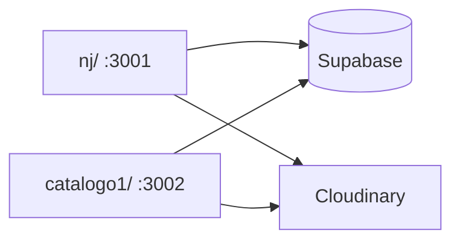

# 44 — Lanzamiento `/catalogo1` — 2026-06-13

## Resumen

Se creó una **copia independiente** del frontend Next.js (`nj/`) en `catalogo1/` para lanzar el catálogo público **sin login ni carrito**, con consulta por **WhatsApp** (`5493625172874`).

- Misma base Supabase de producción: fotos, talles, precios, tags, banners.
- `/nj` sigue en `:3001` como línea de desarrollo (auth + carrito).
- Cutover final: sync `nj` → `catalogo1` cuando la versión completa esté lista.

---

## Arquitectura

### Conservado intacto

- `catalog_public_snapshot`, `lib/supabase/queries.ts`
- `hooks/useCatalog.ts`, `hooks/useEnrichedCatalog.ts`
- Filtros, banners CMS, búsqueda, PDP (galería, color, talle)
- `NEXT_PUBLIC_SUPABASE_URL`, `NEXT_PUBLIC_SUPABASE_ANON_KEY`

### Eliminado

- `app/login`, `app/dashboard`, `app/auth/callback`
- `middleware.ts`, `store/cart.ts`, `hooks/useCart.ts`
- `components/cart/`, `components/notifications/`, `components/profile/`
- Dependencia `zustand`

### Nuevo

- `lib/constants/app.ts` — `BASE_PATH = "/catalogo1"`
- `lib/utils/whatsapp.ts` — mensaje prellenado (portado de `catalogo-publico.js`)
- `components/contact/WhatsAppButton.tsx`
- PDP: CTA sticky WhatsApp; BottomNav: tab WhatsApp; Header: icono WA

---

## Verificación

| Check | Resultado |
|-------|-----------|
| `npm run build` en `catalogo1/` | OK (sin rutas login/dashboard) |
| Dev `:3002/catalogo1` | Home + API `has-ofertas` responden |
| Mismas env vars que `/nj` | `.env.local` copiado |

Checklist manual pre-prod:

- [ ] Mismo producto en `/nj` y `/catalogo1`: fotos, talles, precio, tags
- [ ] PDP: color + talle → WhatsApp con mensaje correcto
- [ ] Banners home desde Supabase
- [ ] Tab Ofertas visible si hay `OfertaActiva`

---

## Despliegue

- Vercel `rootDirectory: catalogo1/`
- No registrar OAuth callbacks para `/catalogo1`

## Riesgos

| Riesgo | Mitigación |
|--------|------------|
| Drift `nj` vs `catalogo1` | Desarrollo solo en `nj`; sync explícito al cutover |
| Paths `/nj` olvidados | `BASE_PATH` + grep antes de deploy |

## Referencias

- `doc/catalogo1/README.md`
- `doc/nj/README.md` (línea de desarrollo)
- [[41-MIGRACION-NEXTJS-NJ-2026-06-08]]
