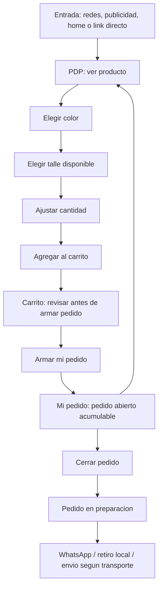

# 49 - Reglas UX del flujo de compra cliente (`/nj`) - 2026-08-10

> Nota canónica para agentes y futuras iteraciones UX. Antes de tocar PDP, carrito, dashboard cliente, textos de pedido, home/index o guía de compra, leer esta nota y mantener coherencia con estas reglas.

Ver también: [[41-MIGRACION-NEXTJS-NJ-2026-06-08]], [[43-NJ-DASHBOARD-PRORROGA-CANCELACION-2026-06-09]], [[46-NJ-KANBAN-PEDIDOS-ADMIN-2026-07-15]], [[48-AUDITORIA-ESTADOS-PEDIDOS-Y-FIXES-2026-08-01]], [[19-AUDITORIA-MODULO-CLIENTE-CARRITO]].

Fuente conceptual: carpeta local del curso **Herramientas y Métodos para potenciar la Experiencia de Usuario 2025** (`C:\Users\gonzi\Music\San Andres\Descargas\Herramientas y Métodos para potenciar la Experiencia de Usuario 2025`). Ideas aplicadas: user journey, storyboard, heurísticas de Nielsen, divulgación progresiva, visibilidad del estado, prevención de errores, lenguaje claro, test de entendimiento, first click, reducción de fricciones y métricas de embudo.

---

## 1. Principio rector

La web `/nj` no es un checkout tradicional. No cobra por la web y no finaliza toda la operación automáticamente. La experiencia debe dejar claro que:

1. El cliente elige productos, colores, talles y cantidades.
2. El carrito es solo una revisión previa.
3. "Mi pedido" es un pedido abierto acumulable durante el plazo vigente.
4. El pedido recién se manda a preparar cuando el cliente toca **Cerrar pedido**.
5. Después del cierre, el equipo prepara el pedido y coordina por WhatsApp o entrega/retiro según transporte.

Regla: cada pantalla debe tener un objetivo principal visible y una sola acción dominante. Si un texto o elemento no ayuda a completar esa acción, debe ir a ayuda contextual, guía rápida o FAQ.

---

## 2. Mobile-first obligatorio

El flujo cliente debe diseñarse y revisarse primero en móvil.

- Ancho mínimo de referencia: **360 px**.
- No asumir que desktop está pulido.
- Priorizar legibilidad, touch targets y jerarquía por encima de decoración.
- Evitar tarjetas o paneles que ocupen más de media pantalla sin necesidad.
- Los controles principales deben verse o quedar naturalmente alcanzables tras una acción.
- Revisar especialmente que textos no se partan mal, no empujen botones ni tapen el contenido inferior.

---

## 3. Perfiles de cliente

### 3.1 Clienta que se abastece

Contexto:

- Ve un producto nuevo en redes.
- Entra probablemente directo al PDP por link de la publicación.
- Quiere comprar para stock propio.
- Puede cargar varios talles y colores del mismo producto.

Necesita:

- Ver el producto con claridad.
- Ver colores disponibles.
- Ver talles disponibles.
- Agregar varias combinaciones sin fricción.
- Revisar que cantidades, colores y talles sean correctos antes de armar/cerrar pedido.

### 3.2 Clienta que toma pedidos

Contexto:

- Descarga imágenes de redes y las ofrece a sus clientas.
- Antes consultaba por WhatsApp si quedaba color/talle.
- Ahora debería poder entrar a la web y validar disponibilidad sin esperar respuesta.

Necesita:

- PDP confiable como verificación de stock.
- Color/talle seleccionables de forma inequívoca.
- Talles sin stock bloqueados o claramente marcados.
- Agregar al carrito exactamente lo que le pidieron.
- Poder repetir PDP -> carrito varias veces antes de cerrar pedido.

### 3.3 No cliente / potencial mayorista

Contexto:

- Entra por publicidad, redes o recomendación.
- No conoce la dinámica mayorista.
- Quiere saber si la web es seria, cómo comprar, mínimos, precios, entrega/retiro y si necesita registrarse.

Necesita:

- Home/index serio, claro y confiable.
- Acceso fácil a precios/productos.
- Explicación breve de cómo comprar sin tener que preguntar por WhatsApp.
- FAQ y guía simple.
- Fricción baja para explorar.

Regla: no cargar el flujo de compra con explicación para no clientes. La explicación profunda vive en home, `Cómo comprar`, FAQ y ayudas `?`; el flujo transaccional mantiene textos breves y contextuales.

---

## 4. Journey canónico cliente

PDP y carrito son pasos repetibles hasta que el cliente cierre el pedido. La web debe permitir volver a sumar productos sin que el cliente sienta que ya terminó todo.

---

## 5. Naming canónico visible para cliente

Usar estos nombres de forma consistente:

| Concepto | Texto recomendado | Evitar |
|---|---|---|
| Carrito | `Carrito` / `Lo que querés pedir` | `Pedido`, `Reserva` |
| Botón desde carrito | `Armar mi pedido` | `Comprar`, `Enviar pedido`, `Finalizar compra` |
| Pedido editable | `Mi pedido` / `Pedido abierto` | `Pedido en espera`, `Reservado`, `Confirmado` |
| Acción final cliente | `Cerrar pedido` | `Pagar`, `Comprar`, `Confirmar producto` |
| Estado post-cierre | `Pedido en preparación` | `Pedido finalizado` si confunde proceso completo |
| Problema de stock | `Sin stock` | `Falta`, `Por confirmar`, `Reservado` |
| Ayuda | `Ver guía rápida`, `¿Cómo funciona?` | textos largos siempre visibles |

Regla importante: **`Reservado` y `Confirmado` son estados internos**. El cliente no debe verlos como etiquetas, pasos ni promesas. Solo debe ver incidencias reales como `Sin stock` o estados de proceso entendibles.

---

## 6. Matriz UX por pantalla

### 6.1 Home / index

Objetivo:

- Que el no cliente entienda rápidamente qué es FYL, que es mayorista, que puede ver productos/precios y cómo comprar.

Debe entender:

- Puede explorar productos.
- Hay mínimo mayorista.
- No se paga por la web.
- La coordinación final ocurre por WhatsApp/retiro/envío según método.

Acción principal:

- Entrar al catálogo o buscar productos.

Riesgos:

- Parecer una web incompleta si no explica el modelo.
- Generar consultas por WhatsApp que la web podría resolver.
- Confundir compra minorista con pedido mayorista.

Reglas:

- La primera pantalla debe verse seria y operativa, no solo decorativa.
- Explicar la dinámica en 3-4 puntos como máximo.
- Llevar a `Cómo comprar` para detalle.
- No bloquear con tutorial automático que robe el primer tap.

### 6.2 PDP

Objetivo:

- Ver producto, color, talle, disponibilidad y agregar cantidad.

Debe entender:

- Qué colores existen.
- Qué color está seleccionado.
- Qué talles están disponibles para ese color.
- Qué talle eligió.
- Cuántas unidades va a agregar.

Acción principal:

- Elegir talle/color/cantidad y agregar al carrito.

Riesgos:

- Que el cliente no entienda que colores/talles son presionables.
- Que seleccione talle pero no vea el selector de cantidad.
- Que confunda indicadores de "poco stock" con estado seleccionado o error.

Reglas:

- Color seleccionado debe tener contraste/marco claro.
- Talle seleccionado debe ser inequívoco.
- Talle sin stock debe estar deshabilitado o visualmente no accionable.
- Evitar indicadores sutiles como puntos luminosos de "poco stock" si confunden.
- Al seleccionar talle, llevar la vista al módulo de cantidad/agregar si queda fuera del viewport.
- No listar demasiadas propiedades del producto juntas; usar jerarquía y divulgación progresiva.

### 6.3 Carrito

Objetivo:

- Revisar productos antes de armar pedido.

Debe entender:

- Esto todavía no es el pedido.
- Puede revisar colores, talles, cantidades y precios.
- Al tocar `Armar mi pedido`, esos productos pasan a `Mi pedido`.
- No se paga ni se envía todavía.

Acción principal:

- `Armar mi pedido`.

Riesgos:

- Que el cliente crea que tener carrito equivale a tener pedido.
- Que el botón parezca compra final.
- Que los totales no tengan jerarquía.

Reglas:

- Mostrar aviso breve: `Esto todavía es solo tu carrito`.
- Botón principal: `Armar mi pedido`.
- Debajo o cerca del botón: `No se paga ni se envía todavía. Vas a poder revisarlo antes de cerrarlo.`
- La tarjeta de total debe priorizar unidades y monto.
- Si un producto del carrito quedó sin stock antes de armar pedido, avisar de forma visible y dar acción para quitar/corregir.

### 6.4 Mi pedido / pedido abierto

Objetivo:

- Ver el pedido acumulado, seguir sumando productos o cerrarlo.

Debe entender:

- Ya armó un pedido abierto.
- Puede seguir agregando productos hasta cerrarlo.
- Tiene un plazo de 7 días para cerrarlo.
- Si llegó al mínimo, la acción recomendada es cerrar el pedido cuando esté listo.
- Si hay un producto sin stock, debe resolverlo.

Acción principal:

- `Cerrar pedido` cuando el mínimo esté completo y no haya incidencias.

Riesgos:

- Que no diferencie carrito de pedido abierto.
- Que crea que el pedido ya se está preparando.
- Que ignore el plazo.
- Que no vea productos sin stock.

Reglas:

- Estado visible: `Pedido abierto`.
- Reforzar solo cuando haga falta: `Podés seguir sumando productos o cerrarlo para que lo preparemos`.
- Mostrar plazo de forma clara, sin dramatizar.
- Cuando falten unidades: mostrar progreso de mínimo sin exagerar.
- Cuando hay `Sin stock`: debe aparecer arriba o destacado, con acción de quitar/reemplazar.
- No mostrar `Reservado`, `Confirmado`, `Por confirmar`, `En espera` al cliente.

### 6.5 Modal de cerrar pedido

Objetivo:

- Confirmar una acción importante: el cliente pide que se prepare su pedido.

Debe entender:

- Al cerrar, ya no es solo edición/acumulación.
- No paga por la web.
- Según transporte, luego se coordina por WhatsApp o retira/paga en local.

Acción principal:

- `Sí, cerrar pedido` o variante según transporte.

**Modal previo de retiro/envío (primera vez al cerrar):**

- Muestra solo las opciones válidas para la localidad del cliente.
- **Corrientes Capital:** únicamente `Retira local` y `MyM` (no Credifin / Snaider / Via Cargo / Correo).
- Texto MyM: `Se enviará a tu domicilio. El pago es contra reembolso: lo abonás junto con el envío cuando te lo entreguen.`
- Fuente: `client/transportes-data.js` + `nj/lib/transport/shipping-helpers.ts`.

Riesgos:

- Texto demasiado largo que se ignora.
- Botón parecido a otros pasos previos.
- Que el cliente no entienda que esta es la acción final de su parte.

Reglas:

- Título corto y específico.
- Resumen de unidades + total con buena separación.
- Explicación máxima 1-2 líneas.
- Botón claro:
  - Retiro local: `Sí, cerrar y preparar retiro`.
  - Envío: `Sí, cerrar y preparar envío`.
- No usar párrafos largos dentro del modal.

### 6.6 Pedido en preparación

Objetivo:

- Confirmar que el cliente ya hizo la acción final y el equipo está preparando.

Debe entender:

- El pedido fue cerrado por el cliente.
- FYL está preparando/revisando operativamente.
- Se le avisará por WhatsApp o podrá retirar/recibir según método.
- Puede ver el detalle del pedido abajo.

Acción principal:

- No hay una acción primaria obligatoria. Acción secundaria: WhatsApp si tiene duda.

Riesgos:

- Que el panel ocupe demasiada pantalla móvil.
- Que diga "enviado" cuando es retiro local.
- Que diga "pedido finalizado" y parezca que todo el proceso terminó.

Reglas:

- Preferir `Pedido en preparación` como estado principal cuando sea posible.
- Panel compacto, con check de éxito pero sin ocupar media pantalla.
- Mensaje condicionado por transporte:
  - Retiro local: `Te avisamos cuando esté listo. Tenés 48 horas para retirarlo y pagás en el local.`
  - SEDE/MyM: `Te avisamos cuando esté listo. Pagás pedido y envío al recibirlo.`
  - Via Cargo/Credifin/Snaider: `Te escribimos cuando esté listo para coordinar pago y envío.`
  - Resto envíos: `Te escribimos cuando esté listo para coordinar el envío.`
- El detalle del pedido debe quedar visible lo antes posible.

### 6.7 Sin stock

Objetivo:

- Resolver una incidencia real.

Debe entender:

- Ese producto ya no está disponible.
- No se puede cerrar hasta resolverlo, o se cerrará sin ese producto según regla aplicada.
- Puede quitarlo o elegir alternativa.

Acción principal:

- Quitar o reemplazar.

Riesgos:

- Que el cliente piense que el pedido entero falló.
- Que el producto sin stock pase inadvertido.
- Que se mezclen estados internos con incidencia real.

Reglas:

- Mostrar solo `Sin stock`.
- Explicar con una frase concreta: `Podés quitarlo o elegir una alternativa disponible`.
- No usar `falta`, `reservado`, `confirmado`, `por confirmar`.
- Ubicar productos sin stock con prioridad visual suficiente, pero sin romper el orden mental del pedido si no es necesario.

---

## 7. Reglas de copy

### 7.1 Voz

La voz debe ser:

- cercana,
- clara,
- concreta,
- mayorista/profesional,
- sin tecnicismos internos.

### 7.2 Tono por contexto

| Contexto | Tono |
|---|---|
| Éxito | breve, tranquilizador |
| Error/sin stock | directo, resolutivo |
| Advertencia de plazo | claro, no alarmista |
| Guía/onboarding | didáctico, liviano |
| Botones | verbo + objeto |

### 7.3 Reglas prácticas

- Una pantalla, una idea principal.
- Frases cortas.
- Evitar explicar todo en cada lugar.
- Prototipar textos dentro de la pantalla, no aislados.
- Si el texto ocupa demasiado en móvil, mover detalle a `?`, guía o FAQ.
- Botón debe decir la consecuencia real de la acción.
- No usar palabras internas de operación si no ayudan al cliente.

### 7.4 Textos prohibidos o riesgosos para cliente

Evitar:

- `Reservado`
- `Confirmado`
- `Por confirmar`
- `Pedido en espera`
- `Finalizar compra`
- `Comprar ahora`
- `Pagar`
- `Envío` cuando el transporte visible es retiro local
- `Entrega` como paso si no se tiene tracking real de entrega

---

## 8. Onboarding y ayuda

No usar tutorial automático intrusivo que aparezca después de unos segundos y capture el primer tap.

Preferir:

- `Ver guía rápida` manual y persistente.
- Ayudas `?` cerca de conceptos que generan duda.
- Microcopy contextual en carrito y pedido.
- Página `Cómo comprar` para explicación completa.
- FAQ formuladas con palabras reales de clientas.

Si se implementa tutorial tipo historias:

- Debe ser voluntario o aparecer antes de que el usuario empiece a interactuar.
- Debe poder cerrarse fácil.
- No debe repetirse agresivamente.
- Debe enseñar el flujo en 3-4 pasos máximo.
- Debe respetar 360 px.

---

## 9. Métricas recomendadas

Métrica North Star sugerida para este flujo:

- **Pedidos cerrados válidos**.

Eventos de embudo a medir:

1. PDP visto.
2. Color seleccionado.
3. Talle seleccionado.
4. Cantidad ajustada.
5. Producto agregado al carrito.
6. Carrito abierto.
7. `Armar mi pedido` tocado.
8. Pedido abierto visto.
9. Mínimo alcanzado.
10. `Cerrar pedido` tocado.
11. Pedido en preparación visto.
12. WhatsApp tocado.
13. Producto sin stock visto.
14. Producto sin stock resuelto.

Métricas cualitativas:

- Test de entendimiento: "¿Qué acaba de pasar?"
- First click: "¿Dónde tocarías para cerrar el pedido?"
- Single Ease Question 1-7: "¿Qué tan fácil fue armar y cerrar el pedido?"
- Tiempo aproximado PDP -> primer producto en carrito.
- Tasa de carritos que nunca llegan a pedido.
- Tasa de pedidos abiertos que no se cierran en 7 días.

---

## 10. Guion mínimo de test con clientas

Usar con 5 personas antes/después de cambios grandes.

1. "Entraste desde una publicación de Instagram por este producto. Elegí color, talle y agregá 2 unidades."
2. "Ahora agregá otro talle/color del mismo producto."
3. "Revisá si tu carrito está correcto."
4. "Convertí ese carrito en pedido."
5. "Decime si ya se envió, si ya se pagó o si todavía falta algo."
6. "Cerrá el pedido para que FYL lo prepare."
7. "Ahora explicame qué va a pasar después."
8. "Si este producto aparece sin stock, ¿qué harías?"

Observar sin ayudar. Responder preguntas con otra pregunta:

- "¿Dónde pensás que está esa acción?"
- "¿Qué entendés que significa este mensaje?"
- "¿Qué esperabas que pasara después de tocar ese botón?"

---

## 11. Prioridades de mejora

### Prioridad 1 - Reducir confusión crítica

- Diferencia carrito vs pedido abierto.
- Botón `Armar mi pedido` vs `Cerrar pedido`.
- Estado post-cierre por transporte.
- Visibilidad de `Sin stock`.
- PDP: talle/color/cantidad claros.

### Prioridad 2 - Mejorar activación

- Home/index para no cliente.
- Guía rápida no intrusiva.
- FAQ con preguntas reales.
- Microcopy breve en momentos críticos.

### Prioridad 3 - Medición y aprendizaje

- Instrumentar embudo.
- Revisar abandonos.
- Hacer test de entendimiento.
- Ajustar copy según observación real.

---

## 12. Checklist para agentes antes de tocar UX cliente

Antes de editar código o copy, responder:

- [ ] ¿Qué perfil de cliente afecta este cambio?
- [ ] ¿Cuál es el objetivo principal de la pantalla?
- [ ] ¿La acción principal se ve primero en móvil 360 px?
- [ ] ¿El botón dice exactamente qué pasa?
- [ ] ¿El cliente podría confundir carrito con pedido?
- [ ] ¿El cliente podría pensar que ya pagó o que ya se envió?
- [ ] ¿El texto usa estados internos (`Reservado`, `Confirmado`)?
- [ ] ¿El mensaje cambia según retiro local/envío cuando corresponde?
- [ ] ¿Hay feedback inmediato después de la acción?
- [ ] ¿El texto visible es lo mínimo necesario?
- [ ] ¿Hay una vía de recuperación si algo sale mal?
- [ ] ¿El cambio deja visible el pedido/productos en móvil o tapa demasiado espacio?

Si alguna respuesta es dudosa, no improvisar copy largo: proponer alternativa, probar en contexto y preferir divulgación progresiva.

---

## 13. Decisiones vigentes

- Cliente no ve `Reservado` ni `Confirmado`; solo incidencias como `Sin stock`.
- `Carrito` no es pedido.
- `Armar mi pedido` convierte carrito en pedido abierto, pero no envía ni paga.
- `Cerrar pedido` es la acción final del cliente para que FYL prepare.
- Post-cierre debe hablar de preparación/retiro/envío según transporte, no usar un mensaje genérico.
- La experiencia se diseña primero para móvil.
- La ayuda debe acompañar, no interrumpir.

