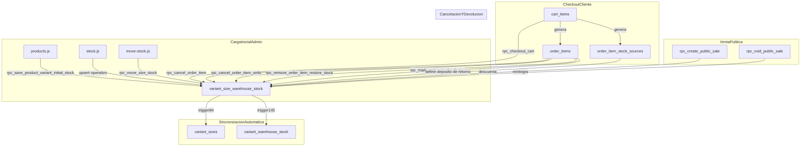

# Auditoría del Sistema de Stock (FYL)

Documento técnico de referencia para operación, auditoría y lanzamiento.

## Estado actual

- Fuente de verdad operativa: `public.variant_size_warehouse_stock`.
- Capas derivadas:
  - `public.variant_sizes.stock_qty` (sincronizada por trigger 84).
  - `public.variant_warehouse_stock.stock_qty` (sincronizada por trigger 145).
- Trazabilidad por salida de stock en pedidos: `public.order_item_stock_sources`.
- Trazabilidad operativa de cambios/movimientos:
  - `public.stock_history` (`log_stock_change`).
  - `public.stock_movements` (movimientos entre depósitos).

## Tablas clave y rol

| Tabla | Rol |
|---|---|
| `variant_size_warehouse_stock` | Stock por `variant_id + size + warehouse_id` (canónica) |
| `variant_warehouse_stock` | Stock agregado por `variant_id + warehouse_id` (derivada/compatibilidad) |
| `variant_sizes` | Catálogo de talles + `stock_qty` agregado por talle (derivada/compatibilidad) |
| `warehouses` | Depósitos (`general`, `venta-publico`) |
| `order_items` | Líneas de pedido |
| `order_item_stock_sources` | Distribución de unidades descontadas por depósito |
| `stock_history` | Historial de ajustes en flujos admin |
| `stock_movements` | Movimientos entre depósitos (ahora con columna `size`) |
| `public_sales` / `public_sale_items` | Flujo de venta pública y trazas para void |

## RPCs y funciones clave

| Función/RPC | Archivo canónico | Acción |
|---|---|---|
| `rpc_save_product_variant_initial_stock` | `139_rpc_save_product_variant_initial_stock.sql` | Carga inicial por talle en depósito `general` |
| `rpc_move_size_stock` | `13_warehouses.sql` + `162_stock_movements_add_size.sql` | Mueve stock por talle entre depósitos |
| `rpc_checkout_cart` | `124_rpc_checkout_cart_deduct_by_size.sql` consolidada en `149` | Descuenta stock y genera trazabilidad por depósito |
| `rpc_cancel_order_item` | `126_rpc_cancel_order_item_return_stock.sql` | Devuelve stock de línea completa |
| `rpc_cancel_order_item_units` | `137_rpc_cancel_order_item_units.sql` | Devuelve stock parcial por unidades |
| `rpc_remove_order_item_restore_stock` | `140_rpc_remove_order_item_restore_stock.sql` | Eliminación admin atómica con devolución de stock |
| `rpc_mark_order_as_devolucion` | `20_mark_order_as_devolucion.sql` corregida en `161` | Devuelve stock de pedido y marca estado devolución |
| `rpc_create_public_sale` / `rpc_void_public_sale` | `141_public_sale_stock_trace_and_void.sql` | Flujo venta pública y reversión |
| `rpc_reconcile_stock` | `146_rpc_reconcile_stock.sql` | Reconciliación de capas derivadas |

## Triggers de integridad

- `trigger_sync_variant_sizes_on_warehouse_stock` (84):
  sincroniza `variant_sizes.stock_qty` desde `variant_size_warehouse_stock`.
- `trigger_sync_variant_warehouse_stock` (145):
  sincroniza `variant_warehouse_stock.stock_qty` desde `variant_size_warehouse_stock`.
- Guards (148):
  bloquean escrituras directas no privilegiadas sobre `stock_qty` derivado.

## Flujo integral de stock



## Problemas detectados y reparados en esta iteración

### 1) Eliminación de ítems enviados desde cliente (crítico)

- Archivo: `admin/sent-orders.js`.
- Antes: devolvía stock con read-modify-write desde JS, siempre a `general`.
- Ahora: usa `rpc_remove_order_item_restore_stock`, que:
  - opera de forma atómica,
  - utiliza `order_item_stock_sources`,
  - normaliza talle,
  - ajusta `total_amount`,
  - evita carreras.

### 2) Devolución de pedido sin trazabilidad por depósito (alto)

- Nuevo archivo: `supabase/canonical/161_fix_devolucion_use_sources.sql`.
- Cambio: `rpc_mark_order_as_devolucion` ahora restaura por `order_item_stock_sources` cuando existe traza.
- Fallback legacy: si no hay fuentes, devuelve a `general`.

### 3) Fallback de catálogo que podía mostrar stock fantasma (alto)

- Archivo: `scripts/main-supabase.js`.
- Cambio: se eliminó el fallback que copiaba `variant_sizes.stock_qty` a `general` cuando faltaban filas canónicas.
- Resultado: catálogo usa únicamente stock real por depósito/talle.

### 4) `stock_movements` sin talle estructurado (medio)

- Nuevo archivo: `supabase/canonical/162_stock_movements_add_size.sql`.
- Cambios:
  - agrega `stock_movements.size`,
  - indexa `(variant_id, size)`,
  - actualiza `rpc_move_size_stock` para guardar talle en columna estructurada.

### 5) Chequeos readonly sin normalización consistente de `size` (medio)

- Archivo: `scripts/stock-consistency-checks-readonly.sql`.
- Cambio: joins y agrupaciones por talle con `TRIM(COALESCE(size::text,''))`.

### 6) Documentación operativa desactualizada (bajo)

- Archivo: `admin/STOCK_OPERATIVA.md`.
- Cambio: alinea la operativa con flujo real (`rpc_save_product_variant_initial_stock` + capas derivadas por triggers).

## Riesgos residuales (a vigilar)

- Si en producción no está aplicada la consolidación (`149`) podría haber cuerpo de RPC desactualizado.
- Registros legacy sin `order_item_stock_sources` dependen de fallback a `general`.
- Cualquier escritura directa fuera de RPCs a tablas derivadas puede reabrir diferencias.

## Verificaciones pre-lanzamiento (SQL)

```sql
-- 1) Gate de salida
SELECT * FROM public.vw_stock_audit_release_gate;

-- 2) Triggers críticos activos
SELECT tgname, tgenabled
FROM pg_trigger
WHERE tgname IN (
  'trigger_sync_variant_sizes_on_warehouse_stock',
  'trigger_sync_variant_warehouse_stock'
);

-- 3) Confirmar RPCs consolidadas
SELECT proname, length(prosrc) AS body_len
FROM pg_proc
WHERE proname IN (
  'rpc_checkout_cart',
  'rpc_close_order',
  'rpc_void_public_sale',
  'rpc_mark_order_as_devolucion',
  'rpc_move_size_stock'
)
AND pronamespace = 'public'::regnamespace;

-- 4) Reconciliar (solo si hay diffs)
SELECT * FROM public.rpc_reconcile_stock();
```

## Recomendación operativa

- Antes de una carga grande de stock:
  1. validar `vw_stock_audit_release_gate`,
  2. ejecutar checks readonly,
  3. corregir diffs con `rpc_reconcile_stock` si aplica,
  4. recién luego iniciar carga masiva.
